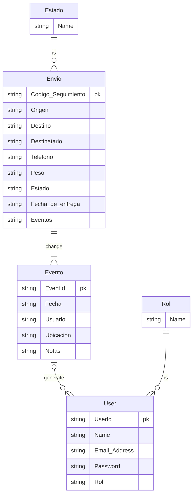

# FullstackLogisticWrk

## Objetivos
- [ ] API Rest con NestJS y PostgreSQL
    - [ ] Autenticación por roles con JWT
    - [ ] Gestión de envíos
    - [ ] Tracking publico de envíos
    - [ ] Asignación de carga
    - [ ] Swagger*
- [ ] Front angular
    - [ ] Login
    - [ ] Registro
    - [ ] Envíos
        - [ ] Exportar a csv*
    - [ ] Detalle envío
    - [ ] Tracking publico
    - [ ] Asignación de vehículos*
    - [ ] Dashboard supervisor*
- [ ] Docker compose*
- [ ] GitHub actions (lint y test)*

## Modelo de datos

## Decisiones

- En un primer momento pensé en crear el monorepo con turborepo por costumbre, pero al encontrar algunas dificultades integrando nestjs con angular, cambié a nx como gestor.
- Uso Prisma por familiaridad y por su gran experiencia de desarrollo junto a PostgreSQL.
