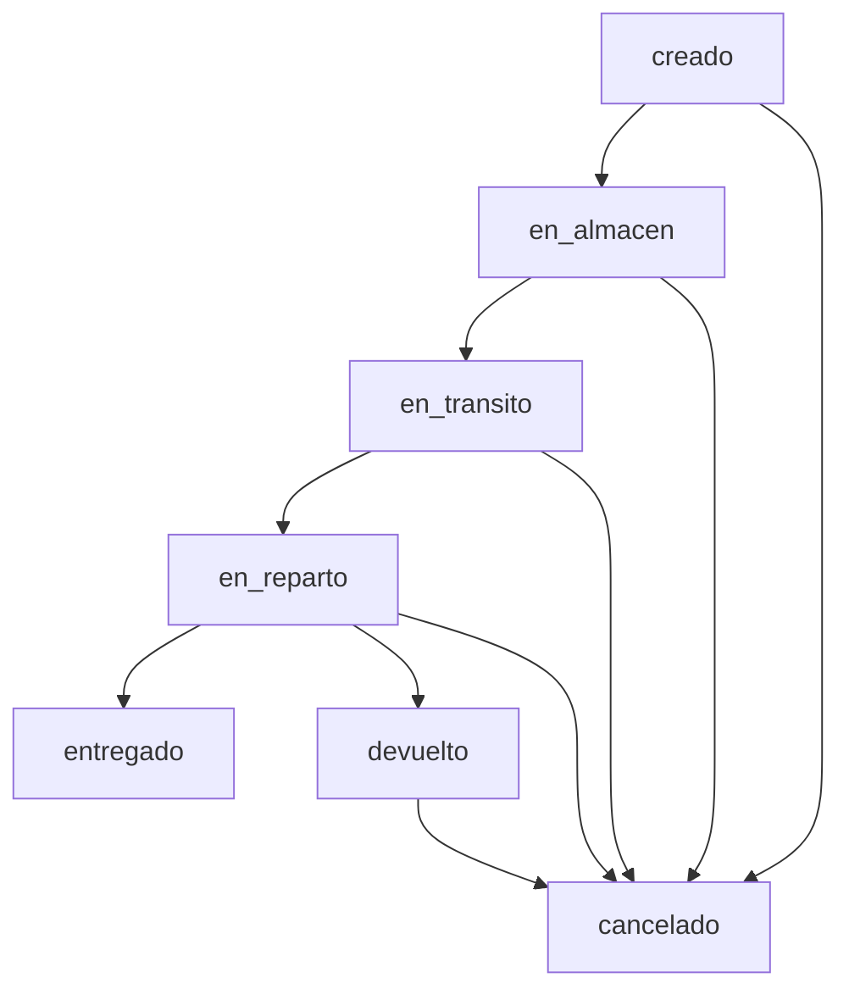

# API

## Flujo de estados

```mermaid
graph TD;
    creado-->en_almacen;
    en_almacen-->en_transito;
    en_transito-->en_reparto;
    en_reparto-->entregado;
    en_reparto-->devuelto;
    creado & en_almacen & en_transito & en_reparto & devuelto-->cancelado;
```
