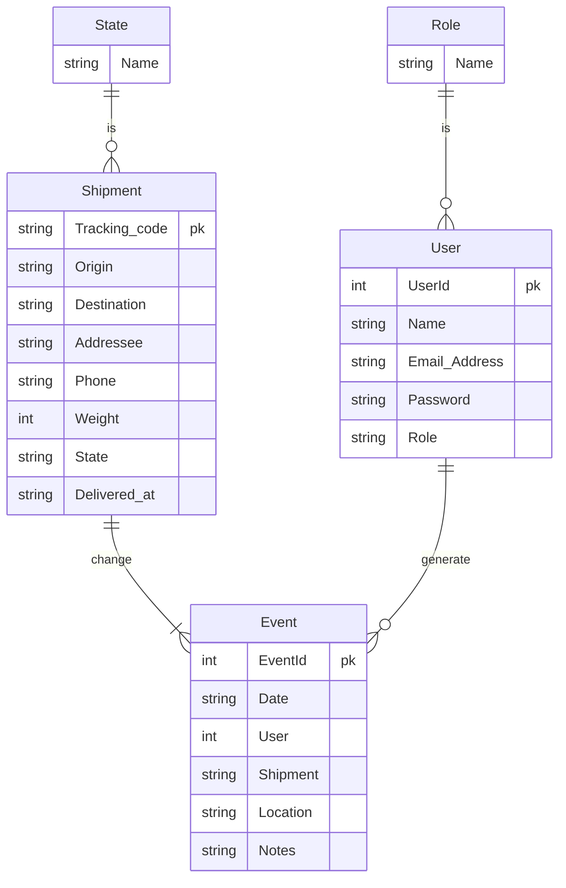

# Prisma

## Modelo de datos

```mermaid
erDiagram
    State {
        string Name
    }
    Shipment {
        string Tracking_code pk
        string Origin
        string Destination
        string Addressee
        string Phone
        int Weight
        string State
        string Delivered_at
    }
    Event {
        int EventId pk
        string Date
        int User
        string Shipment
        string Location
        string Notes
    }
    User {
        int UserId pk
        string Name
        string Email_Address
        string Password
        string Role
    }
    Role {
        string Name
    }

    State ||--o{ Shipment : "is"
    Shipment ||--|{ Event : "change"
    User ||--o{ Event : "generate"
    Role ||--o{ User : "is"
```
